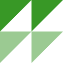

# Color Space Dependence

## Supported blend modes

The behavior of blending depend on the color space (or color model), though the
default behavior follows the W3C's definition.

The following table shows the blend modes and their definitions supported by
each color type.

|         blend mode|`Gray`|`RGB`|`Lab`/`Luv`|`HSV`/`HSL`/`HSI`|
|------------------:|:-----|:----|:----------|:----------------|
|[normal](@ref)     | W3C  | W3C | W3C       | W3C             |
|[multiply](@ref)   | W3C  | W3C | PS-Lab    |                 |
|[screen](@ref)     | W3C  | W3C | PS-Lab    |                 |
|[overlay](@ref)    | W3C  | W3C | PS-Lab    |                 |
|[darken](@ref)     | W3C  | W3C |           |                 |
|[lighten](@ref)    | W3C  | W3C |           |                 |
|[color-dodge](@ref)| W3C  | W3C |           |                 |
|[color-burn](@ref) | W3C  | W3C |           |                 |
|[hard-light](@ref) | W3C  | W3C | PS-Lab    |                 |
|[soft-light](@ref) | W3C  | W3C | PS-Lab    |                 |
|[difference](@ref) | W3C  | W3C |           |                 |
|[exclusion](@ref)  | W3C  | W3C |           |                 |
|[hue](@ref)        |      | W3C | PS-Lab    | HSx             |
|[saturation](@ref) |      | W3C | PS-Lab    | HSx             |
|[color](@ref)      |      | W3C | PS-Lab    | HSx             |
|[luminosity](@ref) |      | W3C | PS-Lab    | HSx             |

The abbreviations in the table mean the definitions of the blending used:
- W3C:
  - [Compositing and Blending Level 1](https://drafts.fxtf.org/compositing-1/)
- PS-Lab:
  - the Lab color mode of Adobe Photoshop
- HSx:
  - Hue-Saturation-{Value/Lightness/Intensity} as Hue-Saturation-"Luminosity"

The color types not shown above and the modes with blank are not officially
supported. Note that even unsupported modes do not explicitly raise errors.
For example, `XYZ` type is calculated in the same way as `RGB` type, but since
`XYZ` values can be greater than `1`, and the [`blend`](@ref) function does not
clip the input colors, the validity of the results is not guaranteed.


## Hue interpolation

There are two ways to interpolate the two angles: clockwise and
counterclockwise. For the hue interpolation, ColorBlendModes uses the way with
the smaller angle between the two hues. Therefore, `HSV`, `HSL` and `HSI` colors
do not have the associative property even in the simple alpha compositing (i.e.
using [`BlendNormal`](@ref normal) and
[`CompositeSourceOver`](@ref source-over)).

```jldoctest; setup=(using ColorTypes, ColorBlendModes;)
julia> blend(HSV(30, 0.5, 0.5), HSV(350, 0.5, 0.5), opacity=0.5) # hue != 190
HSV{Float64}(10.0,0.5,0.5)

julia> c1, c2, c3 = HSL(0, 1, .8), HSLA(120, 1, .8, .5), HSLA(240, 1, .8, .5);

julia> blend(blend(c1, c2), c3)
HSL{Float64}(150.0,1.0,0.8)

julia> blend(c1, blend(c2, c3))
HSL{Float64}(240.0,1.0,0.8)
```

In addition, in the case of blending a gray, i.e., a color with zero saturation,
and a non-gray, the hue of the non-gray color is used.

```jldoctest; setup=(using ColorTypes, ColorBlendModes;)
julia> for w in 0.0:0.2:1.0 # gray to yellow green, not via brown
           println(blend(HSI(12.3, 0.0, 0.5), HSI(78.9, 1.0, 0.5), opacity=w))
       end
HSI{Float64}(78.9,0.0,0.5)
HSI{Float64}(78.9,0.2,0.5)
HSI{Float64}(78.9,0.4,0.5)
HSI{Float64}(78.9,0.6,0.5)
HSI{Float64}(78.9,0.8,0.5)
HSI{Float64}(78.9,1.0,0.5)
```

## Gamma correction

The [`blend`](@ref) function blends colors in a "uniform" space. Note that this
does not mean it blends in the linear RGB space. In other words, the
[`blend`](@ref) function does not care about the gamma.

If you want to blend RGB colors in the linear RGB space and to use the sRGB
input/output, you should manually correct the gamma as follows:
```@example gamma
using ColorTypes, ColorBlendModes
using Main.CompositingExamples #hide
image_green = load("green.png") # in sRGB space
image_blue  = load("blue.png") # in sRGB space

# Note that the following are not the exact sRGB gamma calculations.
to_linear(c::TransparentRGB) =
    typeof(c)(red(c)^2.2, green(c)^2.2, blue(c)^2.2, alpha(c))
to_srgb(c::TransparentRGB) =
    typeof(c)(red(c)^0.4545, green(c)^0.4545, blue(c)^0.4545, alpha(c))

blend_linear(c1, c2; mode=BlendNormal) =
    to_srgb(blend(to_linear(c1), to_linear(c2), mode=mode))

out_srgb   = blend.(image_blue, image_green, mode=BlendScreen) # the result is in sRGB
save("srgb.png", out_srgb) #hide
out = blend_linear.(image_blue, image_green, mode=BlendScreen) # the result is in sRGB
save("linear-rgb.png", out) #hide
```

| space    | Result                            | SVG                                   |
|:--------:|:---------------------------------:|:-------------------------------------:|
|sRGB      |           |           |
|linear RGB|||

!!! note
    Some graphics software also applies the gamma correction to alpha channels
    as grayscale images.
